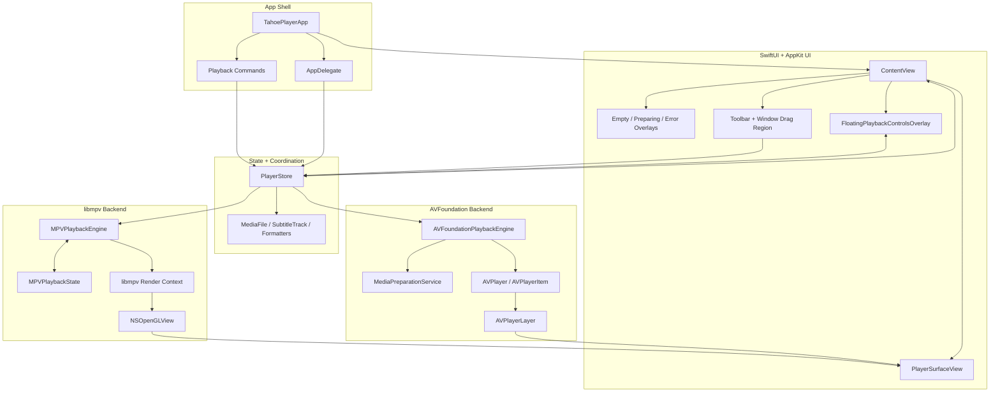
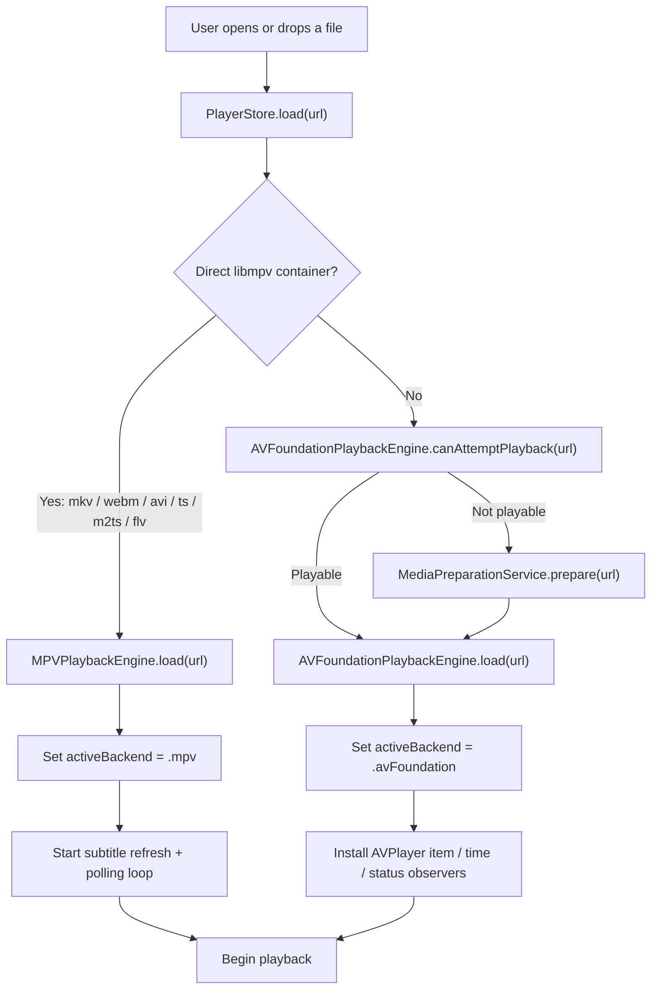
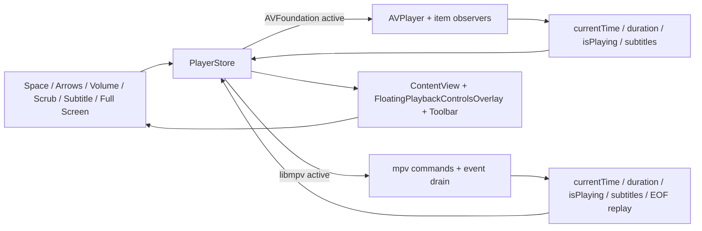
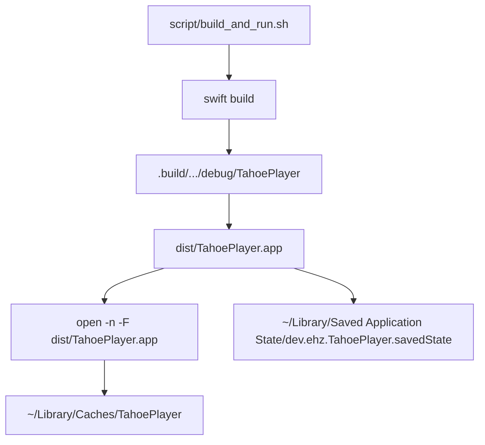

# Tahoe Player

Tahoe Player is a focused macOS 26 (Tahoe) SwiftUI video player for local
files. It uses AVFoundation for Apple-native formats, libmpv for broader
container coverage, and keeps an FFmpeg preparation path for AVFoundation
fallback cases that still need a temporary MP4.

## Requirements

```bash
brew install mpv ffmpeg
```

## Run

```bash
./script/build_and_run.sh
```

`script/build_and_run.sh` stages a local app bundle at `dist/TahoePlayer.app`
so it can be launched like a normal macOS app. It does not install TahoePlayer
into `/Applications`.

## Test

```bash
swift test
```

## Format Support

- MP4/MOV: opened directly with `AVPlayer`.
- MKV/WebM/AVI/TS/M2TS/FLV: opened directly with libmpv, without
  pre-conversion.
- Files that stay on the AVFoundation path but fail native playback can still
  be prepared into a cached MP4 under
  `~/Library/Caches/TahoePlayer/Prepared`.
- Subtitle handling differs by backend:
  - libmpv reads embedded subtitle tracks directly.
  - the FFmpeg fallback converts text subtitles to MP4 `mov_text` for
    AVFoundation playback.
- The floating playback controls can be dragged by the handle and reset with a
  double-click on that handle.

## System Design

### 1. Application Architecture



`PlayerStore` is the center of the app. It receives file-open and command
events, owns user-visible playback state, chooses the active backend, and feeds
the shared surface and floating controls.

### 2. Media Loading And Backend Routing



The load path is intentionally asymmetric. Broad containers go straight to
libmpv. The AVFoundation side only reaches FFmpeg when a file stays on the
Apple-native path but still fails runtime playback checks.

### 3. Playback State And Observation Loop



Both playback engines push their runtime state back through `PlayerStore`, so
the UI stays backend-agnostic. The mpv side adds one extra state machine for
EOF replay and seek completion.

### 4. Local Build And Runtime Footprint



This is the only place TahoePlayer was materialized as a macOS app in your
environment: `dist/TahoePlayer.app`. It was not installed system-wide.

## Project Shape

- `Sources/TahoePlayer/App`: app entry point, commands, AppDelegate.
- `Sources/TahoePlayer/Stores`: playback state and actions.
- `Sources/TahoePlayer/Services`: AVFoundation playback, libmpv playback, media
  preparation, and EOF replay state handling.
- `Sources/TahoePlayer/Views`: AVPlayerLayer/libmpv surfaces plus draggable
  SwiftUI playback controls, subtitle menu, and full-screen handling.
- `Tests/TahoePlayerTests`: regression coverage for libmpv EOF replay state.
- `Resources/AppIcon.icns`: bundled macOS app icon.
- `script/generate_app_icon.swift`: deterministic icon generator.
- `Docs/ManualQA.md`: manual checks for floating-control drag behavior and EOF
  replay.
- `Docs/LearningPlan.md`: scoped Apple-docs learning plan and practice
  problems.
